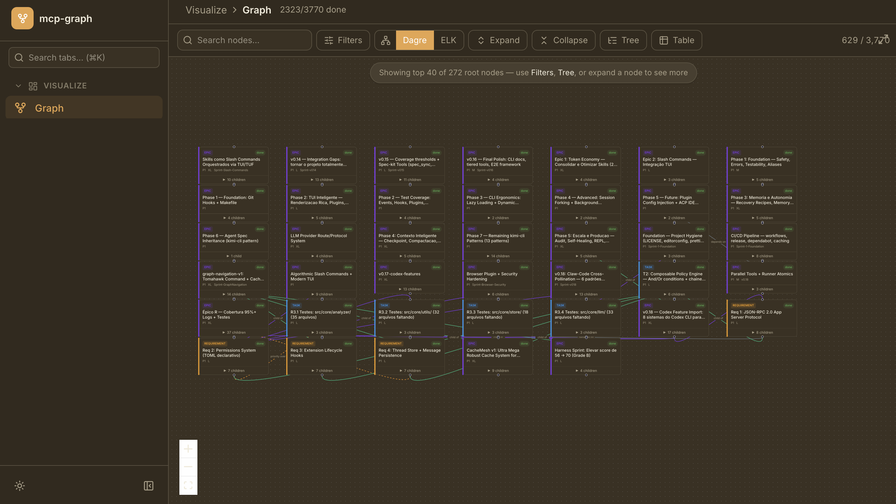
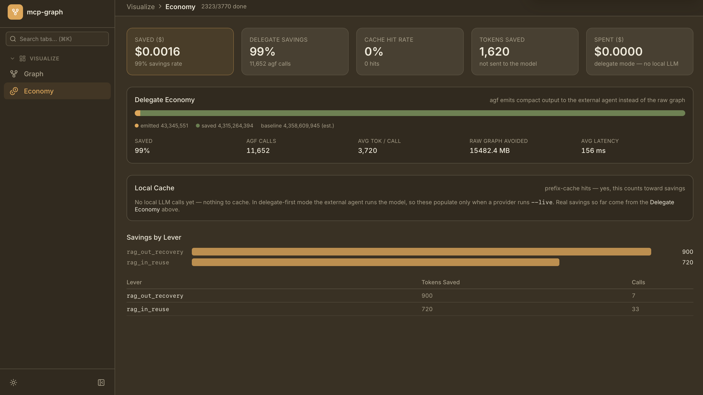

# Superfícies: CLI, TUI, dashboard, MCP, plugins e hooks

O `agf` tem uma superfície principal e várias secundárias. Saber qual usar quando evita
procurar no lugar errado.

## CLI — a superfície principal

São **486 caminhos invocáveis** distribuídos em **155 comandos raiz**. O Apêndice A lista
todos. Tudo que o `agf` sabe fazer está aqui; as outras superfícies são vistas sobre o
mesmo núcleo.

```bash
agf help                            # índice dos principais
agf retrieve-command "<intenção>"   # da intenção ao comando
agf reference                       # guia compilado: ferramentas, skills, fases, gates
```

## TUI — o painel no terminal

```bash
agf tui
```

Interface interativa construída sobre Ink. É uma visão de **leitura** do grafo e do consumo
de tokens, com barra de comandos. Útil para acompanhar sem ficar redigitando `agf stats`.

## Dashboard web

```bash
agf dashboard
```

Sobe uma aplicação React com uma API local. Tem duas abas:

**Grafo** — o grafo navegável, com busca, filtros e detalhamento por nó.



**Economia** — custo real, economia por delegação, cache local e o estado das alavancas.



> **Detalhe que economiza confusão:** o `agf dashboard` serve a versão **já construída** do
> painel, não o código-fonte vivo. Se você alterou o front e não vê a mudança, reconstrua
> (`npm run dashboard:build`) antes de concluir que o servidor está errado.

## MCP — opcional, desligado por padrão

O `agf` nasceu como servidor MCP e migrou para CLI. O MCP continua existindo como
**transporte opcional**, nunca como dependência: todo comando funciona sem ele.

```bash
agf mcp inspect
agf mcp probe
```

Se você não sabe se precisa de MCP, não precisa.

## Plugins

```bash
agf plugin list
agf plugin install <nome>
agf plugin enable <nome>
agf plugin info <nome>
```

Um plugin declara um manifesto e registra tratadores em canais de hook. Ele é carregado sob
demanda e precisa ser idempotente — carregar duas vezes não pode registrar o hook duas
vezes.

## Hooks

O `agf` expõe **46 canais** de hook declarados, dos quais **29 pontos** estão de fato
ligados hoje. A diferença entre "declarado" e "ligado" é justamente o tipo de coisa que a
dimensão de conectividade (Capítulo 9) existe para medir.

```bash
agf hooks list          # os pontos ligados, com módulo e capacidade
agf hooks discover      # o que existe para ligar
agf hooks test <canal>  # dispara um canal
agf hooks add <canal>   # cria o esqueleto de um hook
```

Os canais cobrem sessão, agente, tarefa, contexto, chamadas de LLM, ferramentas, economia,
memória e transições de status. É por aqui que se implementa uma regra que precisa valer
**sempre** — um hook cobra sozinho, um comando precisa que alguém lembre de rodar.

## Skills

São **50 skills** registradas: instruções que orientam um agente a conduzir uma etapa do
ciclo.

```bash
agf skill list
agf skill show <nome>
agf skill new <nome>
```

Elas se distribuem por fase (análise, planejamento, implementação, validação, revisão,
entrega) e por domínio. As três que estruturam o ciclo maior:

| Skill                      | Pilar  | Quando                                         |
| -------------------------- | ------ | ---------------------------------------------- |
| `graph-backlog-generation` | PLAN   | Início de ciclo, ideia vaga, "o que construir" |
| `graph-builder-leafcutter` | BUILD  | Existe tarefa desbloqueada, implementar        |
| `graph-woodpecker`         | HARDEN | O código funciona e precisa endurecer          |

## Autoria: crie pelo CLI

Todos os artefatos extensíveis têm um comando de criação, e usá-lo garante que o artefato
apareça nas listagens:

```bash
agf skill new <nome>
agf agent create <nome>
agf hooks add <canal>
agf plugin install <nome>
```

Criar o arquivo à mão costuma resultar num artefato que existe e que nenhuma superfície
enxerga — exatamente o problema que o Capítulo 9 chama de capacidade dormente.
